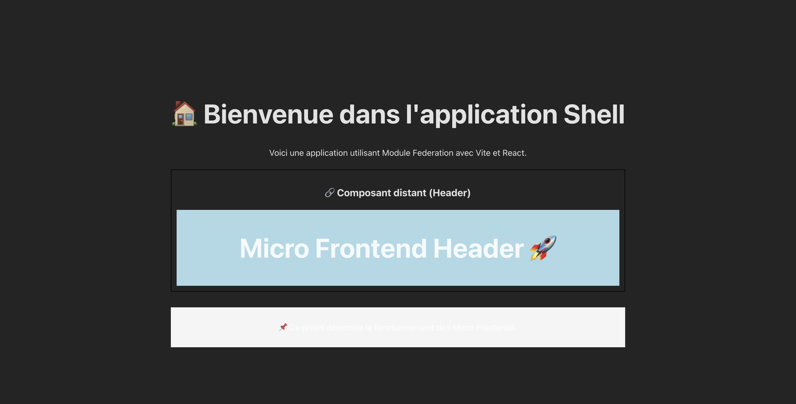

# mfe-atelier
# 📦 Micro Frontend avec Module Federation (Vite + TypeScript)


Ce projet est une démonstration de l'architecture **Micro Frontend** en utilisant **Module Federation**, **Vite** et **React (TypeScript)**.  
Il est composé de deux applications :  

- **`shell`** (l'application hôte)  
- **`header`** (le micro frontend exporté)  

## 📌 Prérequis  

Avant de commencer, assure-toi d'avoir installé :  

- **Node.js** (version recommandée : 16.x ou 18.x)  
- **npm** (version 8.x ou supérieure)  

Vérifie les versions installées avec :  

```bash
node -v
npm -v
```

---  

## 🚀 Installation du projet  

### 1️⃣ **Cloner le dépôt**
```bash
git clone https://github.com/ton-github/mfe-atelier.git
cd mfe-atelier
```

### 2️⃣ **Installer les dépendances**
Exécute les commandes suivantes pour chaque projet (`shell` et `header`) :

```bash
cd shell
npm install --legacy-peer-deps --force
cd ..
```

```bash
cd header
npm install --legacy-peer-deps --force
cd ..
```

---  

## 🏗️ **Build et Exécution du Projet**

### 📌 **Démarrer `header` en premier**
Ouvre un premier terminal et exécute :  

```bash
cd header
npm run build
npm run preview
```

> 🟢 **Accède à `header` sur :**  
> 👉 **http://localhost:3001**  

---  

### 📌 **Démarrer `shell` ensuite**
Ouvre un **deuxième terminal** et exécute :  

```bash
cd shell
npm run dev 
```

> 🟢 **Accède à `shell` sur :**  
> 👉 **http://localhost:3000**  

Si tout fonctionne correctement, l'application **`shell`** devrait afficher le composant **`Header`** provenant de `header`.

---  

## 📝 **Organisation des fichiers**

📂 `shell/` - Application hôte  
📂 `header/` - Micro frontend exporté  

```
mfe-atelier
│── shell/
│   ├── src/
│   │   ├── components/
│   │   ├── App.tsx
│   │   ├── main.tsx
│   │   ├── vite.config.ts
│   │   ├── declarations.d.ts
│── header/
│   ├── src/
│   │   ├── components/
│   │   ├── Header.tsx
│   │   ├── main.tsx
│   │   ├── vite.config.ts
│── README.md
```
